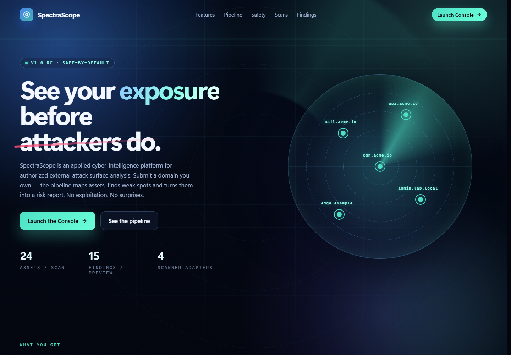

# SpectraScope

[English](README.md) · **Русский**

Безопасная по умолчанию платформа анализа внешней поверхности атаки. SpectraScope находит активы разрешённой цели, нормализует результаты сканеров и формирует приоритетный отчёт.

> [!IMPORTANT]
> Используйте SpectraScope только для собственных систем или при наличии явного разрешения. Реальные сканеры по умолчанию отключены и требуют списка разрешённых доменов.

## Возможности

- Интерфейс на React 19 и TypeScript с дашбордами, триажем и экспортом отчётов.
- API на FastAPI, хранение в PostgreSQL и фоновые задачи Celery/Redis.
- Безопасные адаптеры для subfinder, httpx, nuclei и ограниченного nmap.
- Валидация целей, фиксация авторизации и контроль DNS/IP-области.
- Подписанные HttpOnly-сессии, шифрование настроек интеграций и production-проверки.
- Метрики Prometheus, healthcheck и smoke-тесты полного Docker-стека.

## Быстрый запуск

Нужен Docker Engine или Docker Desktop с Compose v2.

~~~bash
git clone https://github.com/lukianchik/SpectraScope.git
cd SpectraScope
docker compose up --build
~~~

После запуска:

- интерфейс — <http://localhost:3000>
- документация API — <http://localhost:8000/docs>
- readiness — <http://localhost:8000/health/ready>

Стандартный режим использует детерминированные демонстрационные находки. API, база данных, очередь, worker и интерфейс работают полноценно; симулируется только запуск внешних сканеров.

## Архитектура

    React UI → nginx → FastAPI → PostgreSQL
                           ↓
                         Redis → Celery worker → адаптеры сканеров

## Режимы

| Режим | Назначение |
| --- | --- |
| Preview | Безопасная демонстрация с предсказуемыми данными |
| LAB_MODE | HTTP-проверки разрешённых локальных сервисов |
| Local real | Реальные сканеры, ограниченные встроенной лабораторией |
| Real | Явно включённые сканеры с ALLOWED_TARGET_DOMAINS |

Настройка и ограничения сканеров описаны в [docs/scanner-commands.md](docs/scanner-commands.md). Production-требования находятся в [docs/operations.md](docs/operations.md).

## Разработка и проверки

~~~bash
# backend
pip install -r backend/requirements-dev.txt
PYTHONPATH=backend pytest -q
python -m pip_audit -r backend/requirements.txt

# frontend
cd frontend
bun install --frozen-lockfile
bun run lint
bun run build
bun audit --audit-level=high
~~~

Проверка полного продукта:

~~~bash
docker compose up -d --build
python ops/compose_smoke_ci.py
~~~

## Исследовательский статус

SpectraScope — экспериментальный учебно-исследовательский проект, разработанный с применением инструментов искусственного интеллекта. Он распространяется «как есть» и не претендует на полноту, профессиональную сертификацию или готовность к промышленной эксплуатации. Для публикации в интернете нужны TLS, уникальные секреты, резервное копирование, правила хранения данных и независимая проверка безопасности. Подробнее — в [SECURITY.md](SECURITY.md).

Лицензия — [MIT](LICENSE).
